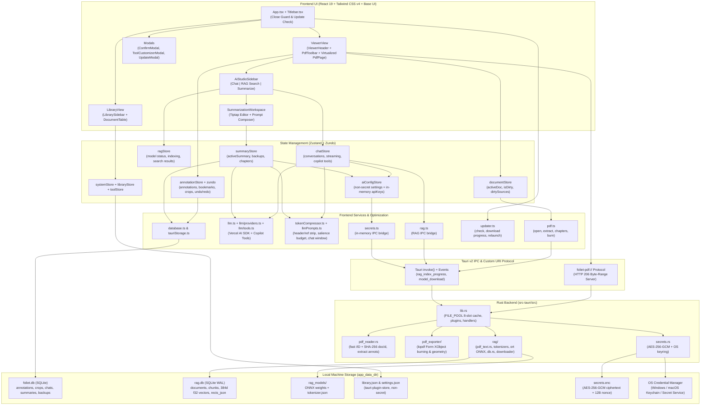

# 01 — High-Level System Architecture

This diagram maps every major layer in Foliet from React components down to Rust modules and local disk storage.

```mermaid
flowchart TB
    subgraph UI["Frontend UI (React 19 + Tailwind CSS v4 + Base UI)"]
        AppShell["App.tsx + Titlebar.tsx\n(Close Guard & Update Check)"]
        LibView["LibraryView\n(LibrarySidebar + DocumentTable)"]
        Viewer["ViewerView\n(ViewerHeader + PdfToolbar + Virtualized PdfPage)"]
        AiSidebar["AiStudioSidebar\n(Chat | RAG Search | Summarize)"]
        SummaryUI["SummarizationWorkspace\n(Tiptap Editor + Prompt Composer)"]
        Modals["Modals\n(ConfirmModal, ToolCustomizerModal, UpdateModal)"]
    end

    subgraph Stores["State Management (Zustand + Zundo)"]
        DocStore["documentStore\n(activeDoc, isDirty, dirtySources)"]
        AnnotStore["annotationStore + zundo\n(annotations, bookmarks, crops, undo/redo)"]
        AiCfgStore["aiConfigStore\n(non-secret settings + in-memory apiKeys)"]
        ChatStore["chatStore\n(conversations, streaming, copilot tools)"]
        RagStore["ragStore\n(model status, indexing, search results)"]
        SumStore["summaryStore\n(activeSummary, backups, chapters)"]
        SysStore["systemStore + libraryStore + toolStore"]
    end

    subgraph Services["Frontend Services & Optimization"]
        PdfSvc["pdf.ts\n(open, extract, chapters, burn)"]
        LlmSvc["llm.ts + llm/providers.ts + llm/tools.ts\n(Vercel AI SDK + Copilot Tools)"]
        Compressor["tokenCompressor.ts + llmPrompts.ts\n(header/ref strip, salience budget, chat window)"]
        RagSvc["rag.ts\n(RAG IPC bridge)"]
        SecretsSvc["secrets.ts\n(in-memory IPC bridge)"]
        UpdaterSvc["updater.ts\n(check, download progress, relaunch)"]
        DbSvc["database.ts & tauriStorage.ts"]
    end

    subgraph Bridge["Tauri v2 IPC & Custom URI Protocol"]
        IPC["Tauri invoke() + Events\n(rag_index_progress, model_download)"]
        Proto["foliet-pdf:// Protocol\n(HTTP 206 Byte-Range Server)"]
    end

    subgraph Rust["Rust Backend (src-tauri/src)"]
        LibRs["lib.rs\n(FILE_POOL 8-slot cache, plugins, handlers)"]
        PdfReader["pdf_reader.rs\n(fast /ID + SHA-256 docId, extract annots)"]
        PdfExporter["pdf_exporter/\n(lopdf Form XObject burning & geometry)"]
        RagEngine["rag/\n(pdf_text.rs, tokenizers, ort ONNX, db.rs, downloader)"]
        SecretsMod["secrets.rs\n(AES-256-GCM + OS keyring)"]
    end

    subgraph Storage["Local Machine Storage (app_data_dir)"]
        FolietDb["foliet.db (SQLite)\nannotations, crops, chats, summaries, backups"]
        RagDb["rag.db (SQLite WAL)\ndocuments, chunks, 384d f32 vectors, rects_json"]
        ModelsDir["rag_models/\nONNX weights + tokenizer.json"]
        JsonStores["library.json & settings.json\n(tauri-plugin-store, non-secret)"]
        SecretsEnc["secrets.enc\n(AES-256-GCM ciphertext + 12B nonce)"]
        Keyring["OS Credential Manager\n(Windows / macOS Keychain / Secret Service)"]
    end

    AppShell --> LibView
    AppShell --> Viewer
    AppShell --> Modals
    Viewer --> AiSidebar
    AiSidebar --> SummaryUI

    LibView --> SysStore
    Viewer --> DocStore
    Viewer --> AnnotStore
    AiSidebar --> ChatStore
    AiSidebar --> RagStore
    SummaryUI --> SumStore
    ChatStore --> AiCfgStore
    SumStore --> AiCfgStore

    DocStore --> PdfSvc
    AnnotStore --> DbSvc
    ChatStore --> LlmSvc
    ChatStore --> Compressor
    ChatStore --> RagSvc
    SumStore --> Compressor
    SumStore --> LlmSvc
    SumStore --> DbSvc
    AiCfgStore --> SecretsSvc
    AppShell --> UpdaterSvc

    PdfSvc --> IPC
    Viewer --> Proto
    RagSvc --> IPC
    SecretsSvc --> IPC
    DbSvc --> FolietDb
    SysStore --> JsonStores

    Proto --> LibRs
    IPC --> LibRs
    LibRs --> PdfReader
    LibRs --> PdfExporter
    LibRs --> RagEngine
    LibRs --> SecretsMod

    RagEngine --> RagDb
    RagEngine --> ModelsDir
    SecretsMod --> SecretsEnc
    SecretsMod --> Keyring
```
